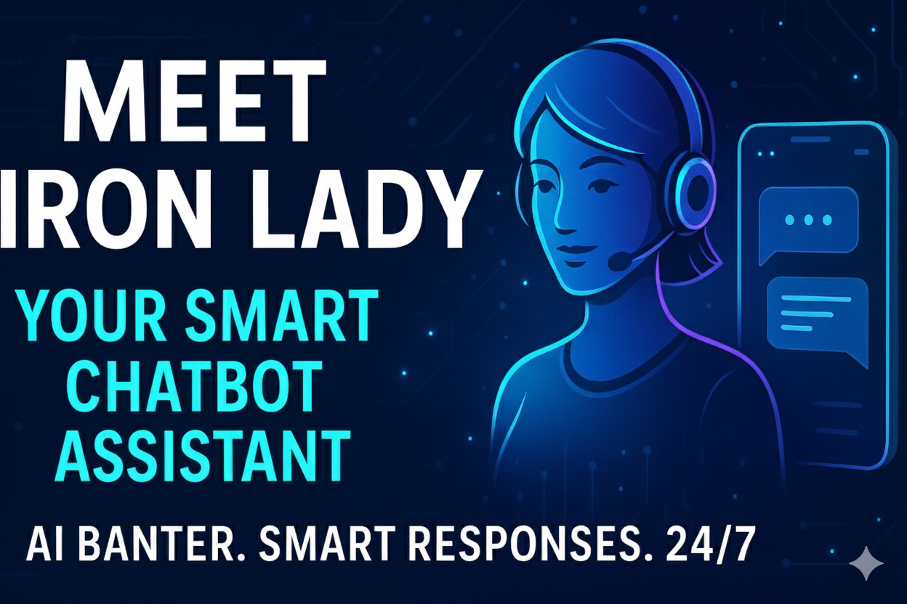

# 📄 Iron Lady Chatbot

A **Streamlit-based chatbot** that answers questions about the Iron Lady organization using **Google Generative AI (Gemini) embeddings and RAG** (Retrieval-Augmented Generation). The chatbot retrieves relevant information from a predefined knowledge base and generates responses based only on that context.

---
## 🎬 Project Demo

<div align="center">
  <a href="https://www.youtube.com/watch?v=PSHRHqCNWRQ" target="_blank">
    
  </a>
  <br>
  <strong><a href="https://www.youtube.com/watch?v=PSHRHqCNWRQ" target="_blank">▶️ Watch: NLP-Query-Engine-For-Data</a></strong>
  <p>Video by Data Science Solutions</p>
</div>

---

## Features

- Interactive **chat interface** using Streamlit.
- **Contextual answers** based on a curated knowledge base.
- Uses **Google Gemini** for embeddings and text generation.
- Supports **RAG workflow** to retrieve the most relevant document chunks.
- Displays **conversation history** for user-friendly interactions.

---

## Knowledge Base

The chatbot is built on the following Iron Lady content:

- Mission, founders, and programs offered.
- Impact statistics, success stories, and events.
- FAQs regarding programs, duration, certificates, and mentorship.

---

## Installation

### 1. Clone the repository

```bash
git clone https://github.com/Uvais5/Iron_lady_chatbot.git
cd Iron_lady_chatbot
```
### 2. Install dependencies
```
pip install -r requirements.txt
```
### 3. Set up environment variables

Create a .env file in the project root:
```
GOOGLE_API_KEY=your_google_generative_ai_api_key_here
```
### 4. Running the App

Run the Streamlit app with:
```
streamlit run app.py
```
